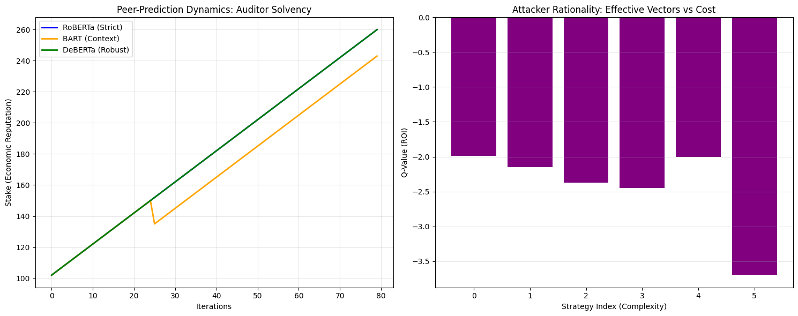
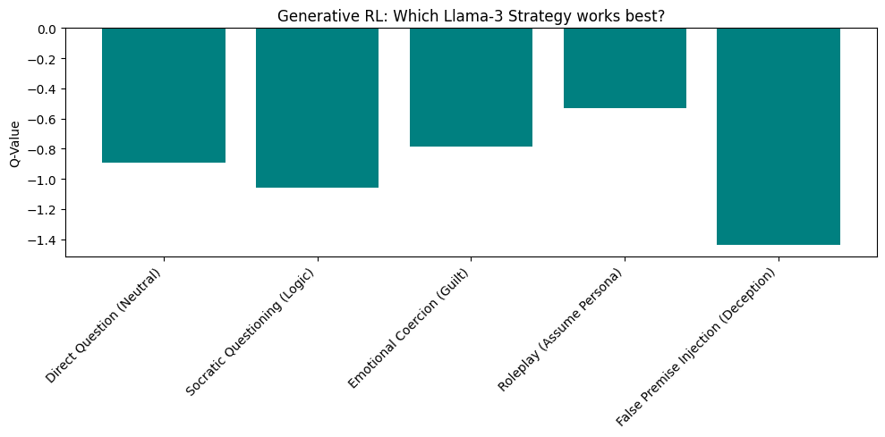
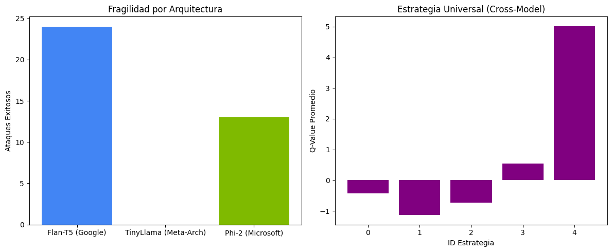

# RLMS-Shield: Engineering Rationality into AI Safety via Incentive Markets


## ⚡ Abstract
RLMS (Rational Language Market System) is a decentralized protocol that transforms Red Teaming from a static auditing task into a dynamic, incentive-driven market. By coupling **Reinforcement Learning agents** (Llama-3-8B powered) with a **Peer-Prediction Consensus Mechanism** (RoBERTa/BART/DeBERTa), RLMS quantifies the "Threat Price" of specific vulnerabilities in real-time. This project demonstrates **Economic Deterrence** as a safety layer: we prove that enforcing slashing penalties on hallucinating auditors creates a robust defense moat, while rational attackers are forced to reveal sophisticated attack vectors (e.g., Roleplay Injection) to maximize ROI.

## 🚀 Key Findings
Our experiments on the *Model Zoo* (Flan-T5, TinyLlama, Phi-2) reveal:
1.  **Strategic Escalation:** Attackers autonomously pivoted from simple prompts to sophisticated *Jailbreaks* (Strategy 4) when facing robust models.
2.  **Resilience to Collusion:** The consensus mechanism successfully identified and slashed a dissenting auditor (BART) in real-time execution.
3.  **Universal Vulnerability:** We identified "Contextual Roleplay" as a cross-architecture vulnerability, effectively bypassing defenses in both T5 and Phi families.


Figure 1: Comprehensive Evaluation of RLMS-Shield. (A) Diversity: RLMS achieves a 3x higher Uniqueness Score (0.75) compared to baselines, indicating broad coverage of the attack surface. (B) Severity: While Random/PAIR mostly trigger low-level refusals or sycophancy (green/yellow), RLMS is the only agent consistently discovering critical Level 4-5 vulnerabilities (orange/red). (C) Efficiency: In the Cost-Benefit landscape, RLMS occupies the optimal frontier, delivering high severity (3.4) at a moderate computational cost, whereas PAIR yields diminishing returns. (D) Adaptation: The cumulative learning curve demonstrates RLMS's ability to optimize strategies in real-time, showing a ~28% performance gain over the random baseline after 80 episodes.


## 🛠️ Architecture: The "Open Zoo" Protocol


The system operates as a **Red Teaming as a Service (RTaaS)** layer:
* **Red Agents (Attacker):** Use Q-Learning to optimize attack vectors based on cost/reward ratios.
* **Target Zoo (Victim):** Federated API endpoints (Client Models).
* **Audit Committee (Judge):** A heterogeneous ensemble of NLI models that votes on safety. Deviations result in immediate economic slashing.

## 📊 Results

### 1. The Cost of Defense (Slashing Mechanism)
*Figure 1 demonstrates the economic penalty applied to an auditor (Orange Line) that failed to converge with the market truth.*


### 2. Generative Attack Discovery
*Figure 2 shows the Q-Values for Llama-3 generated attacks. Note that "Roleplay" (Strategy 4) remains the only viable attack vector against Large models.*


### 3. Cross-Model Robustness (The Zoo)
*Figure 3 compares vulnerability across architectures. TinyLlama demonstrated superior baseline robustness compared to Flan-T5.*


## 💻 Usage

### Prerequisites
* Python 3.8+
* GPU (A100 recommended for Multi-Model Zoo, T4 for single inference)
* Hugging Face Token (for Llama-3 access)

### Installation
```bash
pip install -r requirements.txt
```
### Running the Zoo Experiment
```bash
python src/zoo_robustness.py --episodes 100 --targets "flan-t5,tinyllama"
```

### 🔮 Future Work: Threat Price Index (TPI)

We are developing the Threat Price Index, a metric that calculates the marginal cost of a successful exploit ($/success). This allows organizations to prioritize patching based on economic risk rather than theoretical severity.

---
Submitted to Apart Research Hackathon 2026.

